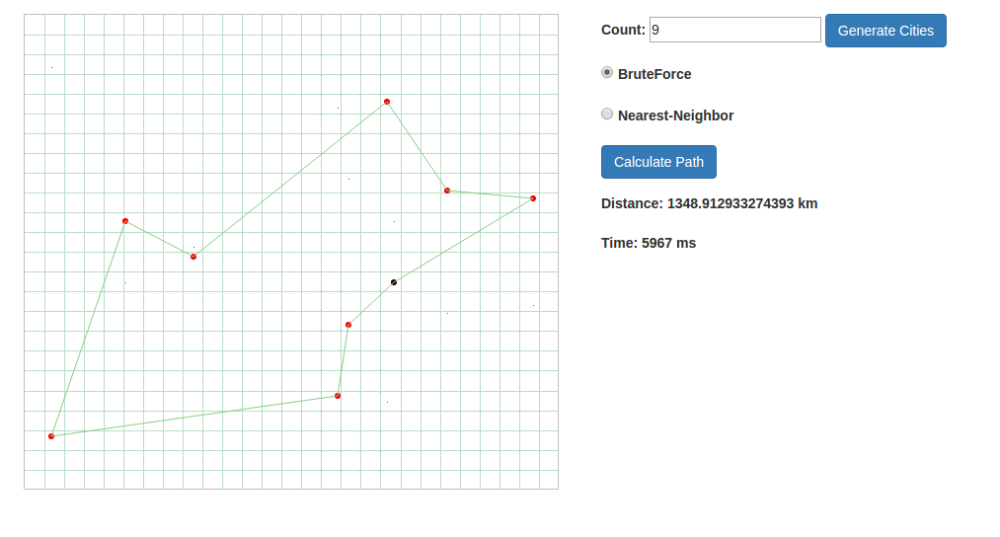
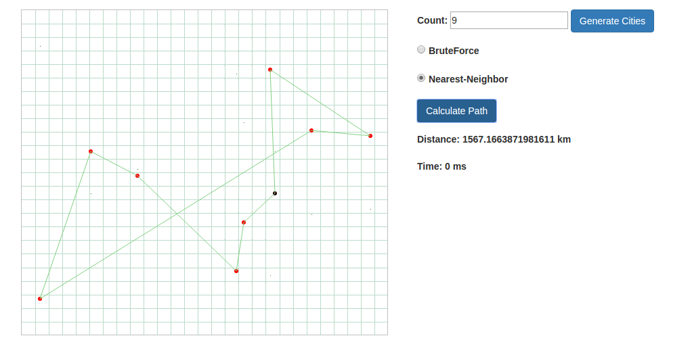

# Travelling Salesman Problem 

Course project for TU-Sofia

 - Server: Using Go
  - Generating Points in 2D system.
  - Calculate best path using BruteForce or NearestNeighbor algorithms 

 - UI: Using VueJS
  - Visualize points and path in html5 canvas

- Build And Run the Server:
 - go build src/* && ./BruteForce 
 - http://localhost:8080

